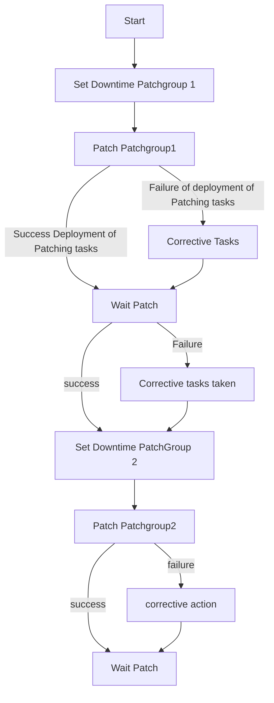
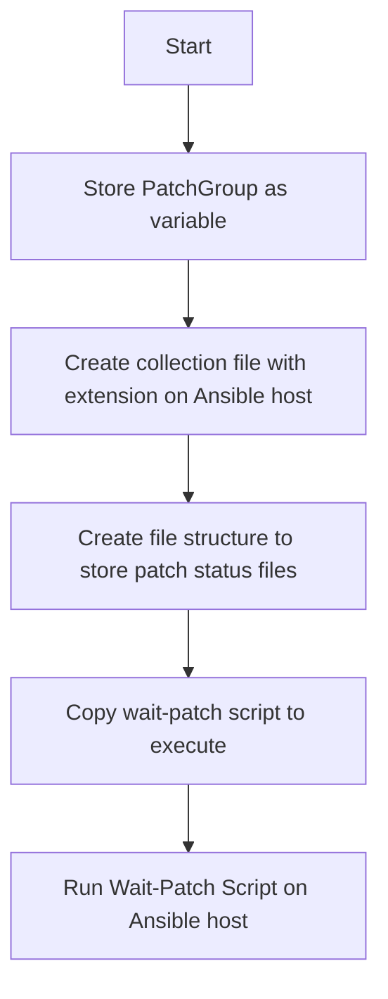

# AnsiblePatchingFramework

This project is for the Orchestration Patching Process in Windows Domain. The scrips are primarily written in Powershell Core and run in a linux context in mind.

# Prerequisites
Powershell Core run on Linux on the Host of the AWX Containers.

# Overview 
This project uses WorkFlow Templates used in Ansible Tower. 
There are 'helper' playbooks that are being called by the main playbooks.

The main playbooks that have been created are:

* apfw_patching_template.yml - calls the main playbook that runs a script that   calls a helper Patching job template in Ansible tower. This sends extra-vars that contains information about end_date and end_time and end-waittime. The purpose of this playbook is so that  the user just has to send a duration to the job with inventory, duration.

* apfw_wait_patch.yml - calls a playbook that configures to run a script to wait on computers  to finish  patching. The script does this by calling the helper playbook get-apfw_patchstatus_file and copy_apfwpatchstatus_to_awx.yml to retrieve patch status files to evaluate. The script will end on three conditions:
  
all servers get Patched

At least one server gets put into a failed status (future iterations could include a threshhold. ).

The overall time has exceeded.

Job templates will contain the different variables for the entire workflow.

Example diagram of patching flow

apfw_wait_patch.yml script

[Workflow template example](../example_workflow_template.md)

[Explaination of Job Templates here.](../job_template.md)

# TODO
* Windows Powershell scripts need to be written (or existing scripts need to be modified so that it is crossplatform) At the moment the structure is written for Linux.

* ~~Yet to be decided whether or not in the wait script the retrieval of files should be individual server. At the time was used for troubleshooting but because ansible has a default fork of 5 it might seem better to handle it that way.~~ This has been done and now the helper playbook referes to the collection as a pose to individual nodes. 
  
* Playbook needs to be written that uses the  tower-cli module to generate these templates in Ansible Tower/AWX so it  can be recreated.

# Bugs
 Powershell Script could continue to run even after the Ansible job has been stopped/cancelled.