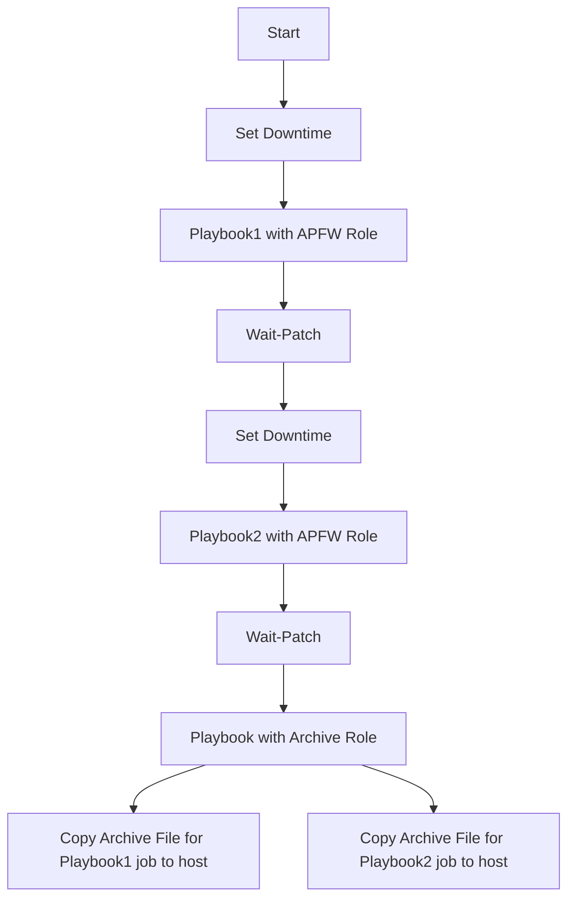

# Workflow Job Template diagram

This patching framework works best with AWX/Ansible Tower Workflow Jobs. Below is  a working example of what a typical workflow might look like:

```mermaid
graph TD
A[Start] --> B[Set Downtime]
B --> C[Playbook1 with APFW Role]
C -->D[Wait-Patch]
D-->E[Set Downtime]
E-->F[Playbook2 with APFW Role]
F-->G[Wait-Patch]
G-->H[Playbook with Archive Role]
H-->J[Copy Archive File for Playbook1 job to host]
H-->K[Copy Archive File for Playbook2 job to host]
```